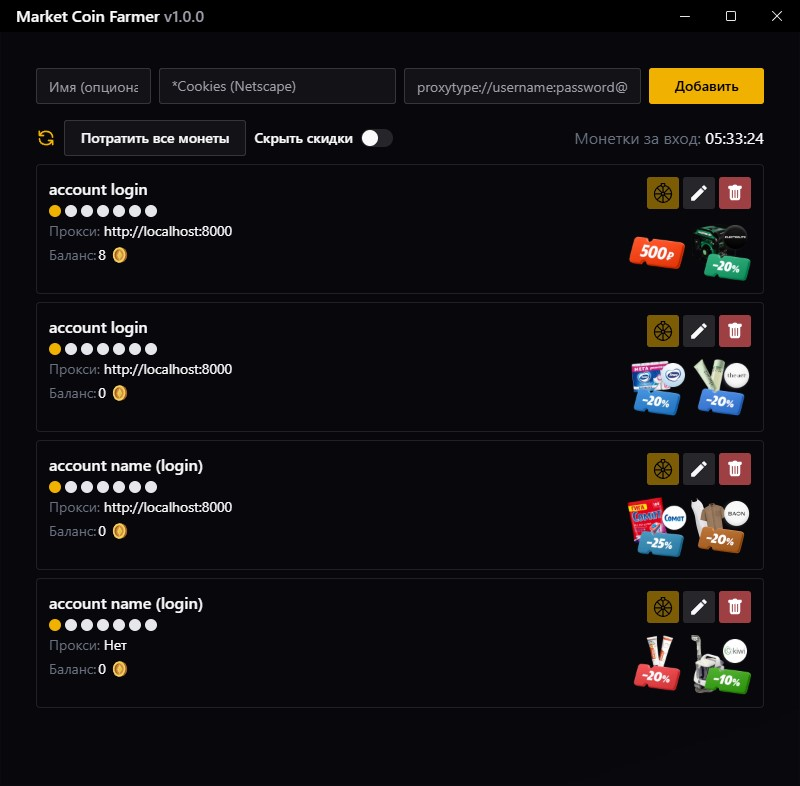

# Market Coin Farmer

## Скачать

[Windows](https://github.com/xob0t/market-coin-farmer/releases/latest/download/market-coin-farmer.exe) 8.1+

## Функции

### Автоматический сбор наград

- **Ежедневные монеты** - Автоматически получает ежедневные бонусы за вход
- **Награды за игровые задания** - Получает награды "Проедьте 5 км без аварий в Market Rush" *(Работает, даже если задание не отображается в учетной записи)*

### Управление аккаунтами

- Работа с несколькими аккаунтами одновременно
- Установка индивидуальных прокси для каждого аккаунта
- Изменение имени, файлов cookie и настроек прокси уже добавленных аккаунтов
- Отображение текущего баланса монет для каждого аккаунтов
- Кнопка "Потратить все монеты" автоматически вращает колеса, пока монеты не закончатся
- Визуальное представление полученных наград

## Частота обновления

- Проверяет статус наград при запуске
- Получает монеты сразу, как они становятся доступными

## Советы

- Используйте кнопку "Обновить все", чтобы принудительно выполнить немедленную проверку статуса
- Скройте скидки с помощью переключателя "Скрыть скидки"

## Сборка

[https://v3alpha.wails.io/getting-started/installation/](https://v3alpha.wails.io/getting-started/installation/)
