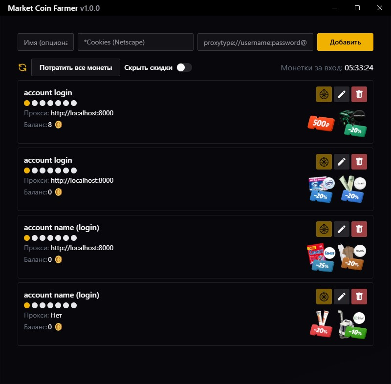

# Market Coin Farmer



Приложение для автоматического сбора монет и наград на [market.yandex.ru](https://market.yandex.ru/kolesoprizov).

## [Скачать](https://github.com/xob0t/market-coin-farmer/releases/latest)

## Функции

### Добавление аккаунтов

- **Вход через браузер** — откроется окно браузера (Edge или Chrome) со страницей входа Яндекса; после входа cookies извлекаются автоматически, аккаунт не нужно настраивать вручную
- **Ручной ввод cookies** — можно вставить cookies в формате Netscape

### Автоматический сбор наград

- **Ежедневные монеты** — автоматически получает ежедневные бонусы за вход
- **Награды за игровые задания** — получает награды за все доступные игры
- **Колесо фортуны** — кнопка «Потратить все монеты» автоматически вращает колесо, пока монеты не закончатся

### Управление аккаунтами

- Работа с несколькими аккаунтами одновременно
- Индивидуальный прокси для каждого аккаунта (поддерживаются HTTP, HTTPS и SOCKS5, в том числе с авторизацией)
- Изменение имени, cookies и прокси уже добавленных аккаунтов
- Отображение текущего баланса монет для каждого аккаунта
- Индикатор блокировки: если Яндекс отклоняет запрос (403, VPN/прокси), это показывается прямо на карточке аккаунта
- Визуальное представление полученных наград с копированием промокодов

## Частота обновления

- Проверяет статус наград при запуске
- Получает монеты сразу, как они становятся доступными

## Сборка

Требуется [Wails v3](https://v3.wails.io/getting-started/installation/).

```sh
wails3 dev     # запуск в режиме разработки
wails3 build   # сборка приложения
```

Также можно использовать [Task](https://taskfile.dev/) как обёртку: `task dev` / `task build`.

Приложение кроссплатформенное (Windows, Linux, macOS).
